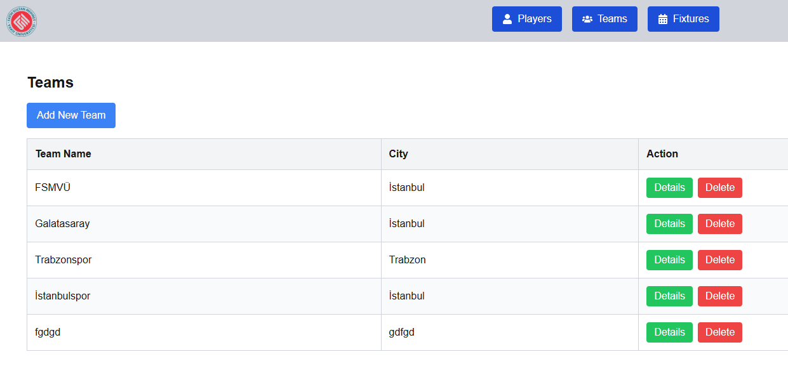
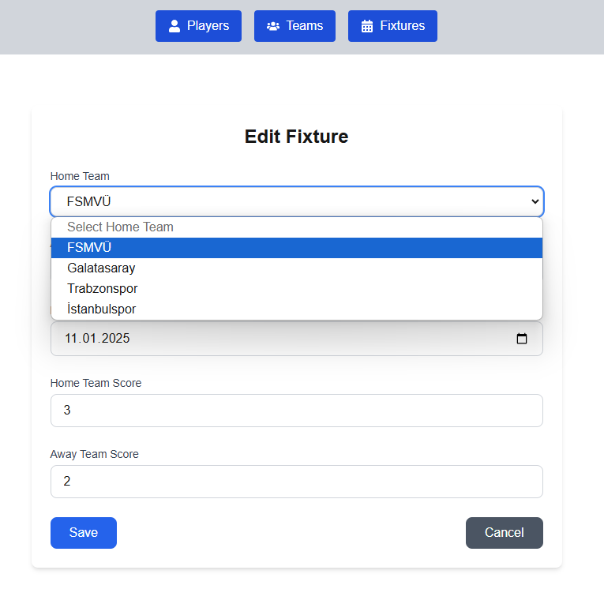

# Sport and Fixture Management Application

This is a full-stack web application developed as a final project for the **BLM19417E Web Design and Programming** course. The application allows users to manage sports teams, players, and fixtures efficiently. It provides full CRUD functionality and real-time feedback using modern web technologies.

## Features

- **Teams Management**: View, add, edit, and delete teams.
- **Players Management**: Manage players associated with different teams.
- **Fixtures Management**: Schedule fixtures, record match results, and track match status.
- **Dynamic Statistics**: Detailed statistics for each team, including total matches, wins, losses, draws, and not-played fixtures.
- **User-Friendly Interface**: Clean and responsive UI with color-coded status indicators.
- **Real-Time Status Messages**: Instant feedback on operations using Redux.

## Technology Stack

- **Frontend**: React (with Next.js and Tailwind CSS)
- **Backend**: ASP.NET Core Web API
- **Database**: SQL Server
- **State Management**: Redux

## Project Structure

```plaintext
SportAndFixture/
├── SportAndFixtureFrontend/    # Frontend (React + Next.js)
├── SportAndFixtureWebApi/      # Backend (ASP.NET Core Web API)
├── Screenshots/                # Screenshots of the application
├── Report.docx                 # Detailed project report (Word)
├── Report.pdf                  # Detailed project report (PDF)
└── README.md                   # Project documentation
```

## Setup Instructions

### Prerequisites

- **Node.js**: Ensure that Node.js (v14+) is installed.
- **.NET SDK**: Install the .NET SDK (v6.0+).
- **SQL Server**: Ensure SQL Server is installed and running.

### Backend Setup (ASP.NET Core Web API)

1. Navigate to the backend project directory:
   ```bash
   cd SportAndFixtureWebApi
   ```
2. Restore dependencies:
   ```bash
   dotnet restore
   ```
3. Update the database connection string in `appsettings.json`.
4. Apply migrations and create the database:
   ```bash
   dotnet ef database update
   ```
5. Run the Web API:
   ```bash
   dotnet run
   ```

The backend will start at `https://localhost:5001`.

### Frontend Setup (React + Next.js)

1. Navigate to the frontend project directory:
   ```bash
   cd SportAndFixtureFrontend
   ```
2. Install dependencies:
   ```bash
   npm install
   ```
3. Start the development server:
   ```bash
   npm run dev
   ```

The frontend will be available at `http://localhost:3000`.

## Usage

1. Open the frontend in your browser: `http://localhost:3000`
2. Use the navigation menu to explore the application:
   - **Teams**: Manage all registered teams.
   - **Players**: View and manage players.
   - **Fixtures**: Schedule fixtures and track results.

## Screenshots

### Teams Page


### Team Details Page


### Players Page


### Fixtures Page


### Edit Fixture Page


### Delete Player Confirmation


## License
This project is licensed under the MIT License. Feel free to use, modify, and distribute it as needed.

## Author
Developed by **MeSeKara** as a final project for **BLM19417E Web Design and Programming**.
